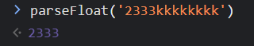

# Calculadora Simple

Esta es una calculadora simple que puede realizar sumas, restas, multiplicaciones y divisiones. El código está escrito en JavaScript y HTML.


## Archivo app.js

El archivo `app.js` contiene la lógica de la calculadora. Define las funciones para cada una de las operaciones, así como la función para calcular el resultado y mostrarlo en el elemento `resultado`.


## Archivo index.html

El archivo `index.html` contiene el HTML para la calculadora. Incluye los campos de entrada para los operandos, el elemento de selección para la operación y los botones para calcular y borrar el resultado.


## Achivo styles.css
El archivo `styles.css` contiene el CSS para la calculadora. Define los estilos para los campos de entrada, el elemento de selección, los botones y el elemento `resultado`.


## Primeros Pasos
Para usar la calculadora, ingrese los dos operandos en los campos de entrada, seleccione la operación y haga clic en el botón `Calcular`. El resultado se mostrará en el elemento `resultado`.


Aquí hay algunos detalles adicionales sobre el código:

* Las funciones `suma()`, `resta()`, `multiplicacion()` y `division()` toman dos números como argumentos y devuelven el resultado de la operación.

* La función `calcularResultado()` toma la operación como una cadena y los dos operandos como números y devuelve el resultado de la operación.

* La función `main()` es la función principal de la calculadora. Obtiene los valores de los operandos y la operación de los campos de entrada, llama a la función `calcularResultado()` para calcular el resultado y muestra el resultado en el elemento `resultado`.

* La función `borrar()` borra los valores de los operandos y la operación de los campos de entrada y establece el elemento `resultado` en `Resultado`.

¡Espero que esto ayude!


## Comenzando 🚀


Accede, ingresa números y haz tu operaciones


### Pre-requisitos 📋


Explorador Web con acceso a internet.


```
Coogle Chrome
```
```
Firefox
```

### Instalación 🔧


No requiere

## Casos de Prueba

|ID|Resumen|Precondiciones|Datos de Entrada|Pasos|Resultado Esperado|Restulado Obtenido|
| - | - | - | - | - | - | - |
|1|Sumar|input1 e input2 completados, válidos y operación seleccionada|Números  Enteros o decimales|* competar el pimer operando *seleccionar operación *completar el segundo operando * presionar botón Calcular *Verificar el resultado en la parte inferior|muestre el resultado de la suma de los datos ingresados|ok|
|2|Restar|input1 e input2 completados, válidos y operación seleccionada|Números  Enteros o decimales|* competar el pimer operando * seleccionar operación * completar el segundo operando * presionar botón Calcular * Verificar el resultado en la parte inferior|muestre el resultado de la resta de los datos ingresados|ok|
|3|Multiplicar|input1 e input2 completados, válidos y operación seleccionada|Números  Enteros o decimales|* competar el pimer operando * seleccionar operación * completar el segundo operando * presionar botón Calcular * Verificar el resultado en la parte inferior|muestre el resultado de la multiplicación de los datos ingresados|ok|
|4|Dividir|input1 e input2 completados, válidos y operación seleccionada|Números  Enteros o decimales|competar el pimer operando * seleccionar operación * completar el segundo operando * presionar botón Calcular * Verificar el resultado en la parte inferior|muestre el resultado de la división de los datos ingresados|ok|
|5|Dividir por 0|input2 con el valor númerico 0 e input1 completo, válido y operación división seleccionada|Números  Enteros o decimales|completar el pimer operando  * seleccionar operación división * completar el segundo operando con 0 * presionar botón Calcular|muestre un mensaje en el explorador alertando que no es posible dividir por 0|ok|
|6|Dejar primer input vacío|input1 incompleto|Números  Enteros o decimales|NO completar el pimer operando * seleccionar operación(indistinto) * completar el segundo operando(indistinto) * presionar botón Calcular|muestre un mensaje en el explorador alertando que no es posible dejar vacío el primero input|ok|
|7|Dejar Sin Selección en lista|no seleccionar operación|Números  Enteros o decimales|* completar el pimer operando  * NO seleccionar operación * completar el segundo operando (indistinto) .presionar botón Calcular|muestre un mensaje en el explorador alertando que no es posible No seleccionar una operación de la lista desplegable|ok|
|8|Dejar segundo input vacío|input2 incompleto|Números  Enteros o decimales|* completar el pimer operando  * seleccionar operación * No completar el segundo operando *presionar botón Calcular|muestre un mensaje en el explorador alertando que no es posible dejar vacío el segundo input|ok|
|9|Alerta y Truncamiento de Números extenos|input1 e input2 completados, válidos y operación seleccionada|Números  Enteros o decimales|* competar el pimer operando con un numero de al menos 20 digitos en su parte entera(99999999999999999999) * seleccionar operación multiplicación * completar el segundo operando con el número 9 * presionar botón Calcular * Verificar el resultado en la parte inferior|muestre un mensaje de alerta advirtiendo que por ser muy largo el resultado será truncado para poder ser mostrado|ok|
|10|Botón Borrar|input1 e input2 completados, válidos y operación seleccionada|Números  Enteros o decimales|* completar el pimer operando  * seleccionar operación * completar el segundo operando * presionar botón Calcular * Verificar el resultado en la parte inferior|al presionar el botón los inputs, la lista de selección y el resultado deben reestablecerse a su estado original de indicar el ingreso de nuevas entradas, seleccionar una operación e indicar donde se ve el Resultado|ok|
|11|input1 con string|input1 con letras e input2 completo, válido y operación seleccionada|Strings|* completar el pimer operando con caracteres * seleccionar operación (indistinto) * completar el segundo operando (indistinto) * presionar botón Calcular|muestre un mensaje de alerta indicando que no es un número|ok|
|12|input2 con string|input2 con letras  e input1 completao, válido y operación seleccionada|Strings|* competar el pimer operando  * seleccionar operación * completar el segundo operando con caracteres * presionar botón Calcular|muestre un mensaje de alerta indicando que no es un número|ok|
| - | - | - | - | - | - | - |


## Despliegue 📦


No Requiere


## Construido con 🛠️

    HTML5 

    CSS3

    JavaScript


## Detecciòn de errores con sus Resoluciones ✒️


1. Era posible ingresar letras en los inputs y esto pasaba porque al aplicar el método parseFloat() a un string que empiece con un número toma solo esta parte:




Implementación:

`    `*// declara e inicializa las variables accediendo al valor del elelmento*

`    `let ope1 = parseFloat(document.getElementById("operando1").value);

`    `let ope2 = parseFloat(document.getElementById("operando2").value);

`    `let operacion = String(document.getElementById("selector").value);

`    `*// calcula el resultado y lo guarda en la variable local "resultado"* 

`    `*// let resultado = calcularResultado(operacion, parseFloat(ope1), parseFloat(ope2));*

`    `let resultado = calcularResultado(operacion, ope1, ope2);


Resolución:

Se rediseña el flujo de pasos en el procedimiento aceptando los valores tal cual los ingresa el usuario, luego se hacen varias verificaciones mediante condicional <if> anidados  como : que no esté vacío, que sean números, que no se pueda dividir en 0, etc, y en el cálculo del resultado se aplica el método parseFloat() a los operandos.

`    `*// declara e inicializa las variables accediendo al valor del elelmento*

`    `let ope1 = document.getElementById("operando1").value;

`    `let ope2 = document.getElementById("operando2").value;

`    `let operacion = String(document.getElementById("selector").value);

`    `*// calcula el resultado y lo guarda en la variable local "resultado"* 

`    `let resultado = calcularResultado(operacion, parseFloat(ope1), parseFloat(ope2));

Resultado: mensaje de alerta indicando que no es un número vàlido.


2 – Si el resultado es más extenso que el área donde es mostrado se advierte que será truncado para ser mostrado. Se configura en 18 dìgitos:


Resolución: 


Resultados: se muestra una alerta con el resultado real y se advierte que se truncará para ser mostrado. Al dar aceptar al mensaje de alerta el resultado truncado podrá ser visualizado.


## Licencia 📄


Este proyecto está bajo  Licencia por vacaciones largas.


## Expresiones de Gratitud 🎁


* Invita una cerveza 🍺 o un café ☕ a alguien del equipo. 

* Gracias a todos y todas que confiaron en esta gran péqueño proyecto 🤓. No hay devolución del dinero, que lástima! =/

* Dona con cripto a esta dirección: `0xf253fc233333nnnnmmmmmn111175e5a76a649890000`


---
⌨️ con ❤️ 
